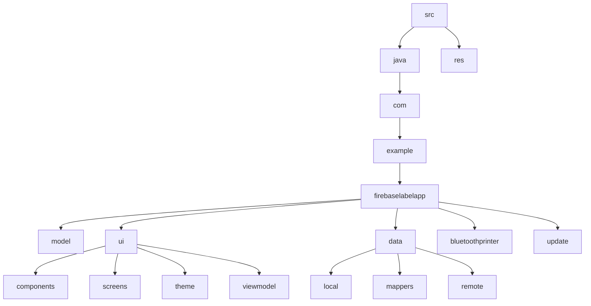

# Firebase Label App
## 🗂️ Description

The Firebase Label App is an Android application designed to manage and print labels using Firebase services. The app allows users to create, edit, and manage labels, as well as connect to Bluetooth printers for printing. It features a user-friendly interface built with Jetpack Compose and utilizes Firebase Firestore for data storage and authentication.

The app is intended for businesses and individuals who need to efficiently manage and print labels for various purposes, such as inventory management, shipping, or product labeling.

## ✨ Key Features

### **Label Management**
* Create, edit, and delete labels
* Organize labels into menus and categories
* Assign expiration dates and descriptions to labels

### **Printing and Connectivity**
* Connect to Bluetooth printers for label printing
* Configure print settings, such as text size and density
* Support for multiple printer connections

### **Authentication and Authorization**
* Firebase authentication for secure login and registration
* Role-based access control for managing label access

### **Data Storage and Management**
* Firebase Firestore for storing label data and settings
* Local database for offline access and caching

## 🗂️ Folder Structure

## 🛠️ Tech Stack

## ⚙️ Setup Instructions

* Clone the repository: `git clone https://github.com/puntusovdima/FirebaseLabelApp.git`
* Open the project in Android Studio
* Configure Firebase services:
	+ Create a Firebase project and enable Firestore and Authentication
	+ Download the `google-services.json` file and add it to the `app` directory
* Build and run the app on a physical device or emulator
